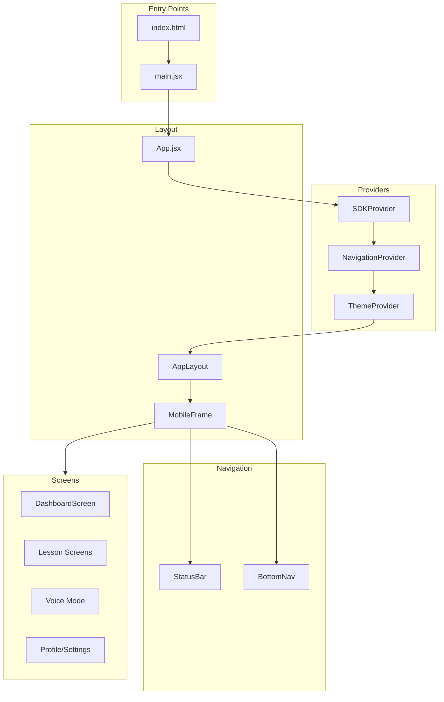
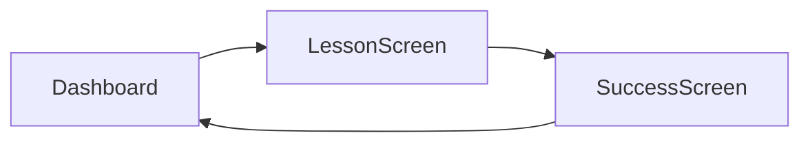
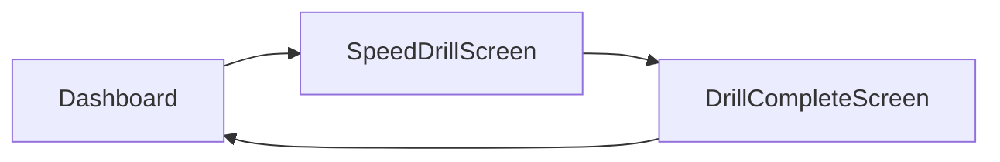
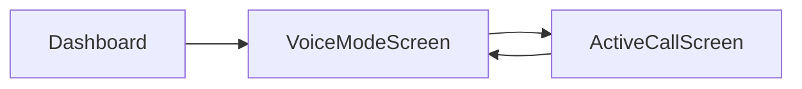
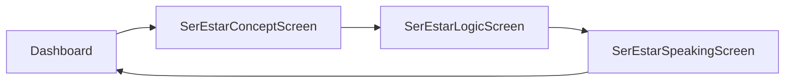
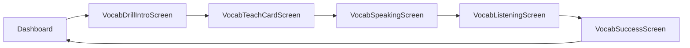

# SpanishVIP Campus - Wireframe View

A mobile-first React application for learning Spanish through AI-powered interactive lessons, voice practice, and structured curriculum. This wireframe prototype demonstrates the complete user experience flow for the SpanishVIP language learning platform.

---

## 📋 Table of Contents

1. [Overview](#overview)
2. [Technology Stack](#technology-stack)
3. [Architecture](#architecture)
4. [Project Structure](#project-structure)
5. [Core Features](#core-features)
6. [Navigation System](#navigation-system)
7. [SDK Configuration System](#sdk-configuration-system)
8. [Component Library](#component-library)
9. [Screen Flows](#screen-flows)
10. [Theming & Styling](#theming--styling)
11. [Mobile Optimization](#mobile-optimization)
12. [PWA Support](#pwa-support)
13. [Build & Performance](#build--performance)
14. [Development Guide](#development-guide)
15. [Future Enhancements](#future-enhancements)

---

## Overview

**SpanishVIP Campus** is an interactive Spanish language learning application that combines:

- **Structured curriculum** with modules and lessons
- **AI-powered voice practice** for conversational skills
- **Multiple activity types** (quizzes, speaking drills, roleplay, matching games)
- **Progress tracking** with achievements and statistics
- **VIP features** for advanced learners

The application is designed as a **mobile-first** experience with responsive support for tablets and desktops, featuring a simulated mobile frame on larger screens.

---

## Technology Stack

### Core Framework
| Technology | Version | Purpose |
|------------|---------|---------|
| React | ^18.2.0 | UI component library |
| React DOM | ^18.2.0 | DOM rendering |
| React Router DOM | ^6.21.0 | Client-side routing |

### UI Framework
| Technology | Version | Purpose |
|------------|---------|---------|
| MUI (Material-UI) | ^5.15.0 | Component library |
| MUI Icons | ^5.15.0 | Icon set |
| Emotion React | ^11.11.0 | CSS-in-JS styling |
| Emotion Styled | ^11.11.0 | Styled components |

### Build Tools
| Technology | Version | Purpose |
|------------|---------|---------|
| Vite | ^5.0.0 | Build tool & dev server |
| @vitejs/plugin-react | ^4.2.0 | React plugin for Vite |
| Terser | ^5.26.0 | JavaScript minification |

### Analytics & Monitoring
| Technology | Version | Purpose |
|------------|---------|---------|
| web-vitals | ^3.5.0 | Core Web Vitals tracking |

---

## Architecture

The application follows a **component-based architecture** with clear separation of concerns:



### Key Architectural Patterns

1. **Context-based State Management**: Uses React Context for SDK configuration and navigation state
2. **Lazy Loading**: All screen components are lazy-loaded with React.lazy for optimal bundle splitting
3. **Custom Hooks**: Encapsulates logic in reusable hooks (useNavigation, useSDKConfig, useRecording)
4. **Centralized Theming**: Dynamic MUI theme generation based on SDK configuration
5. **Error Boundaries**: Graceful error handling with user-friendly fallback UI

---

## Project Structure

```
SpanishVIP-Wireframe-View/
├── public/                      # Static assets
│   ├── manifest.json           # PWA manifest
│   ├── sw.js                   # Service worker
│   ├── favicon.svg             # App favicon
│   └── icon-*.png              # App icons (various sizes)
│
├── src/
│   ├── main.jsx                # Application entry point
│   ├── App.jsx                 # Root component with providers
│   │
│   ├── components/             # Reusable UI components
│   │   ├── Dashboard/          # Dashboard-specific components
│   │   │   ├── HeroCard.jsx
│   │   │   ├── QuickWinCard.jsx
│   │   │   ├── ModuleList.jsx
│   │   │   └── UpsellBanner.jsx
│   │   │
│   │   ├── Lesson/             # Lesson UI components
│   │   │   ├── FeedbackCard.jsx
│   │   │   └── MicrophoneButton.jsx
│   │   │
│   │   ├── Profile/            # Profile screen components
│   │   │   ├── ProfileHeader.jsx
│   │   │   ├── StatisticsSection.jsx
│   │   │   ├── AchievementCard.jsx
│   │   │   └── AchievementsSection.jsx
│   │   │
│   │   ├── Settings/           # Settings UI components
│   │   │   ├── SettingsSection.jsx
│   │   │   ├── SettingsToggle.jsx
│   │   │   ├── SettingsInput.jsx
│   │   │   ├── SettingsSelect.jsx
│   │   │   └── SettingsButton.jsx
│   │   │
│   │   ├── Review/             # Review screen components
│   │   │   ├── MistakeCard.jsx
│   │   │   └── VocabCard.jsx
│   │   │
│   │   ├── Sales/              # Sales/upsell components
│   │   │   ├── PricingCard.jsx
│   │   │   ├── TestimonialSlider.jsx
│   │   │   └── TutorCard.jsx
│   │   │
│   │   ├── VIP/                # VIP lesson components
│   │   │   └── VIPTeachScreen.jsx
│   │   │
│   │   ├── VoiceMode/          # Voice practice components
│   │   │   ├── AudioVisualizer.jsx
│   │   │   └── LiveCaptions.jsx
│   │   │
│   │   └── shared/             # Shared/common components
│   │       ├── MobileFrame.jsx
│   │       ├── StatusBar.jsx
│   │       ├── BottomNav.jsx
│   │       ├── SofiaAvatar.jsx
│   │       ├── StatCard.jsx
│   │       ├── LoadingScreen.jsx
│   │       ├── ErrorBoundary.jsx
│   │       ├── sharedStyles.js
│   │       └── sharedAnimations.js
│   │
│   ├── screens/                # Full-page screen components
│   │   ├── DashboardScreen.jsx
│   │   ├── LessonScreen.jsx
│   │   ├── SuccessScreen.jsx
│   │   ├── SpeedDrillScreen.jsx
│   │   ├── DrillCompleteScreen.jsx
│   │   ├── VoiceModeScreen.jsx
│   │   ├── ActiveCallScreen.jsx
│   │   ├── ReviewScreen.jsx
│   │   │
│   │   ├── SerEstar*Screen.jsx     # Ser/Estar grammar lessons (3 screens)
│   │   ├── Vocab*Screen.jsx        # Vocabulary lessons (5 screens)
│   │   ├── VIP*Screen.jsx          # VIP survival lessons (10 screens)
│   │   └── Travel*Screen.jsx       # Travel module lessons (9 screens)
│   │
│   ├── context/                # React Context providers
│   │   ├── SDKContext.jsx      # SDK configuration management
│   │   ├── NavigationContext.jsx # Navigation state management
│   │   └── SDK_CONFIG_SCHEMA.md  # SDK configuration documentation
│   │
│   ├── hooks/                  # Custom React hooks
│   │   ├── useNavigation.js    # Navigation hook
│   │   ├── useSDKConfig.js     # SDK config hook
│   │   ├── useRecording.js     # Voice recording hook
│   │   ├── useTimer.js         # Timer hook
│   │   └── useCountdown.js     # Countdown hook
│   │
│   ├── data/                   # Mock data and content
│   │   ├── mockUserData.js     # User profile/settings data
│   │   └── travelLessonData.js # Travel lesson activities data
│   │
│   └── theme/                  # Theming configuration
│       └── muiTheme.js         # Dynamic MUI theme generator
│
├── index.html                  # HTML entry point
├── package.json                # Dependencies and scripts
├── vite.config.js              # Vite configuration
└── vercel.json                 # Vercel deployment config
```

---

## Core Features

### 1. Dashboard Hub
The main entry point displaying:
- **Hero Card**: Current lesson progress with Sofia's personalized nudge
- **Quick Win Card**: Short activity CTAs for time-constrained users
- **Module List**: Expandable curriculum with lesson progression
- **Upsell Banner**: Human tutor booking promotion

### 2. Lesson System
Multiple lesson flows supporting various activity types:

| Activity Type | Description |
|--------------|-------------|
| Image Select | Match vocabulary to images |
| Tap Pair | Match Spanish-English word pairs |
| Translation | Multiple choice translation |
| True/False | Grammar correctness evaluation |
| Sentence Builder | Arrange words to form sentences |
| Fill-in-the-Blank | Complete sentences with correct forms |
| Audio Transcription | Type what you hear |
| Speaking Drill | Pronunciation practice |
| Audio Discrimination | Distinguish similar-sounding words |
| Roleplay | Conversational AI scenarios |

### 3. Voice Practice Mode
AI-powered conversational practice:
- Topic selection (Order Coffee, Travel Plans, Job Interview)
- Animated microphone button with pulse effect
- Real-time audio visualization
- Live captions display

### 4. Progress Tracking
- Streak counting
- XP accumulation
- League system (Bronze, Silver, Gold, etc.)
- Achievement badges with progress indicators

### 5. User Profile & Settings
- Profile customization
- Statistics display
- Account management
- Preference controls (sound, animations, dark mode)

---

## Navigation System

The application uses a centralized navigation system through [`NavigationContext.jsx`](src/context/NavigationContext.jsx).

### Screen Constants
All screens are defined as constants to avoid magic strings:

```javascript
export const SCREENS = {
  DASHBOARD: 'dashboard',
  LESSON: 'lesson',
  SUCCESS: 'success',
  SPEED_DRILL: 'speedDrill',
  // ... 35+ screen types
}
```

### Navigation Functions
The context provides screen-specific navigation functions:

| Function | Purpose |
|----------|---------|
| `showDashboard()` | Return to dashboard |
| `showLessonRunner()` | Start lesson screen |
| `showSuccess()` | Show completion screen |
| `showSpeedDrill()` | Start timed practice |
| `showVoiceMode()` | Enter voice practice |
| `startActiveCall()` | Begin voice conversation |
| `goBack()` | Navigate to previous screen |
| `setActiveTab(tab)` | Switch bottom nav tab |

### Navigation Features
- **History Stack**: Maintains navigation history with 10-item limit
- **Transition Animations**: Smooth fade/translate transitions
- **Full-Screen Detection**: Certain screens hide StatusBar and BottomNav
- **Loading States**: Minimum loading time prevents UI flashing

### Usage Example
```javascript
import { useNavigation, SCREENS } from '../hooks/useNavigation.js'

function MyComponent() {
  const { currentScreen, showDashboard, navigateTo } = useNavigation()
  
  return (
    <Button onClick={showDashboard}>
      Go Home
    </Button>
  )
}
```

---

## SDK Configuration System

The app integrates with an external Element SDK for dynamic content and styling customization.

### Configuration Properties

#### Text Properties
| Property | Default | Description |
|----------|---------|-------------|
| `hero_headline` | "Continue Unit 1: Cafe Culture" | Hero card main text |
| `hero_subheadline` | "Lesson 4: Ordering with Politeness" | Hero card subtitle |
| `hero_button` | "Resume Class" | Hero CTA button text |
| `sofia_nudge` | "You left off at the Roleplay..." | Sofia's personalized message |
| `quick_win_headline` | "Short on time?" | Quick win card headline |
| `quick_win_action` | "Do a 2-Min Vocab Drill ⚡" | Quick win CTA |
| `upsell_text` | "Stuck on a concept?" | Upsell banner text |
| `upsell_action` | "Book a Human Tutor ($15)" | Upsell CTA |

#### Color Properties
| Property | Default | Description |
|----------|---------|-------------|
| `hero_card_bg` | #14B8A6 | Hero card background |
| `hero_card_text` | #FFFFFF | Hero card text color |
| `surface_color` | #FFFFFF | App background |
| `text_color` | #111827 | Primary text color |
| `primary_action_color` | #FFFFFF | Button/accent color |

### SDK Integration
```javascript
// Accessing configuration in components
import useSDKConfig from '../hooks/useSDKConfig.js'

function MyComponent() {
  const config = useSDKConfig()
  
  return (
    <Box sx={{ backgroundColor: config.surface_color }}>
      <Typography>{config.hero_headline}</Typography>
    </Box>
  )
}
```

### Fallback Behavior
When `window.elementSdk` is unavailable, the app gracefully falls back to default configuration values without errors.

---

## Component Library

### Shared Components

#### MobileFrame
Simulates mobile viewport (375x812px iPhone X dimensions):
- Full-screen on mobile devices
- Centered frame with shadow on desktop
- Responsive breakpoints for tablets
- Safe area inset support

#### StatusBar
Displays user progress metrics:
- Streak days counter
- Voice energy minutes
- Dynamic background color

#### BottomNav
Five-tab navigation bar:
- Home (Dashboard)
- Review (Study materials)
- Voice (Voice practice)
- Profile (User profile)
- Settings (Preferences)

Features:
- 48x48px minimum touch targets (WCAG AAA)
- Safe area inset support for notched devices
- Active state animations

#### SofiaAvatar
AI tutor avatar with customizable:
- Size (small/medium/large)
- Emoji expression
- Gradient border effect

#### ErrorBoundary
Catches JavaScript errors with:
- User-friendly error message
- "Try Again" and "Return to Dashboard" buttons
- Development mode error details
- Custom event dispatch for navigation reset

### Dashboard Components

| Component | Purpose |
|-----------|---------|
| `HeroCard` | Main lesson progress card with Sofia's nudge |
| `QuickWinCard` | Short activity promotion |
| `ModuleList` | Expandable curriculum tree |
| `UpsellBanner` | Human tutor booking CTA |

### Settings Components

| Component | Purpose |
|-----------|---------|
| `SettingsSection` | Grouped settings container |
| `SettingsToggle` | Boolean preference switch |
| `SettingsInput` | Text input field |
| `SettingsSelect` | Dropdown selection |
| `SettingsButton` | Action button |

---

## Screen Flows

### Main Lesson Flow


### Speed Drill Flow


### Voice Practice Flow


### Ser/Estar Grammar Flow


### Vocabulary Drill Flow


### VIP Survival Flow

```mermaid
graph LR
    DASH[Dashboard] --> INTRO[VIPSurvivalIntroScreen]
    INTRO --> SHIELD[VIPTeachShieldScreen]
    SHIELD --> BRAKE[VIPTeachBrakeScreen]
    BRAKE --> TOOL[VIPTeachToolScreen]
    TOOL --> LOGIC[VIPLogicCheckScreen]
    LOGIC --> SPEAK[VIPSpeakingDrillScreen]
    SPEAK --> SETUP[VIPScenarioSetupScreen]
    SETUP --> ROLEPLAY[VIPRoleplayScreen]
    ROLEPLAY --> SUCCESS[VIPSuccessScreen]
    SUCCESS --> DASH
```


### Travel Lesson Flow (Module 3, Lesson 1)
12 activity sequence covering:
1. Image Select
2. Tap Pair
3. Translation
4. True/False
5. Sentence Builder
6. Fill-in-the-Blank
7. Audio Transcription
8. Speaking Drill
9. Audio Discrimination
10. Roleplay
11. Conversation Completion
12. Cultural Context

---

## Theming & Styling

### Dynamic Theme Generation
The [`muiTheme.js`](src/theme/muiTheme.js) file creates MUI themes dynamically based on SDK configuration:

```javascript
function createMuiTheme(sdkConfig = {}) {
  const primaryColor = sdkConfig.hero_card_bg || '#0AA6A6'
  
  return createTheme({
    palette: {
      primary: { main: primaryColor },
      background: { default: sdkConfig.surface_color || '#F3F4F6' },
      text: { primary: sdkConfig.text_color || '#111827' }
    },
    // ... additional theme configuration
  })
}
```

### Color Palette
| Color | Hex | Usage |
|-------|-----|-------|
| Primary Teal | #0AA6A6 | Brand color, CTAs, active states |
| Secondary Orange | #F97316 | Accents, warnings |
| Success Green | #22C55E | Correct answers, achievements |
| Error Red | #EF4444 | Incorrect answers, destructive actions |
| Surface White | #FFFFFF | Card backgrounds |
| Background Gray | #F3F4F6 | App background |
| Text Primary | #111827 | Main text |
| Text Secondary | #6B7280 | Supporting text |

### Typography
| Font Family | Usage |
|-------------|-------|
| Lexend | Headlines (h1-h6), bold weight |
| Inter | Body text, UI elements |

### Touch Optimization
All interactive elements include:
- Minimum 48x48px touch targets (WCAG AAA)
- `touch-action: manipulation` to prevent double-tap zoom
- Scale animations on active/press state
- Removed webkit tap highlight

---

## Mobile Optimization

### Viewport Configuration
```html
<meta name="viewport" content="width=device-width, initial-scale=1.0, maximum-scale=1.0, user-scalable=no, viewport-fit=cover">
```

### PWA Meta Tags
```html
<meta name="theme-color" content="#0AA6A6">
<meta name="apple-mobile-web-app-capable" content="yes">
<meta name="apple-mobile-web-app-status-bar-style" content="black-translucent">
<meta name="mobile-web-app-capable" content="yes">
```

### Safe Area Support
All layout components respect iOS safe area insets:
```css
padding-top: env(safe-area-inset-top, 0px);
padding-bottom: env(safe-area-inset-bottom, 0px);
```

### Touch Behavior
```css
/* Prevent pull-to-refresh */
overscroll-behavior-y: contain;

/* Smooth iOS scrolling */
-webkit-overflow-scrolling: touch;

/* Prevent text selection on buttons */
-webkit-user-select: none;
user-select: none;
```

### Responsive Breakpoints
| Breakpoint | Range | Layout |
|------------|-------|--------|
| Mobile | < 600px | Full screen |
| Tablet | 600-900px | 90vw, max 450px |
| Large Tablet | 900-1200px | 450px centered |
| Desktop | > 1200px | 375px phone frame |

---

## PWA Support

### Web App Manifest
```json
{
  "name": "SpanishVIP Campus",
  "short_name": "SpanishVIP",
  "description": "Learn Spanish with AI-powered voice practice",
  "display": "standalone",
  "orientation": "portrait-primary",
  "theme_color": "#0AA6A6",
  "background_color": "#F8FAFC"
}
```

### Service Worker
Registered in production for:
- Offline support
- Cache management
- Update notifications

### App Icons
- 16x16, 32x32 (favicons)
- 180x180 (Apple touch icon)
- 192x192, 512x512 (PWA icons)

---

## Build & Performance

### Build Configuration
The [`vite.config.js`](vite.config.js) includes:

#### Code Splitting Strategy
```javascript
manualChunks: (id) => {
  if (id.includes('node_modules/react/')) return 'vendor-react'
  if (id.includes('node_modules/@mui/material/')) return 'vendor-mui'
  if (id.includes('node_modules/@mui/icons-material/')) return 'vendor-mui-icons'
  if (id.includes('/src/screens/')) return `screen-${screenName}`
}
```

#### Output Chunks
| Chunk | Contents |
|-------|----------|
| `vendor-react` | React core libraries |
| `vendor-mui` | Material-UI core + Emotion |
| `vendor-mui-icons` | MUI icons (lazy loaded) |
| `screen-*` | Individual screen components |

#### Optimization Features
- Terser minification with console/debugger removal
- CSS code splitting
- Asset inlining for files < 4KB
- Source maps disabled in production

### Web Vitals Tracking
```javascript
import { getCLS, getFID, getFCP, getLCP, getTTFB } from 'web-vitals'

// Development: colored console logs
// Production: extendable to analytics service
```

### NPM Scripts
| Script | Purpose |
|--------|---------|
| `npm run dev` | Start development server (port 3000) |
| `npm run build` | Production build |
| `npm run build:prod` | Production build (explicit mode) |
| `npm run build:analyze` | Build with bundle visualization |
| `npm run preview` | Preview production build |
| `npm run lint` | ESLint check |
| `npm run type-check` | TypeScript validation |

---

## Development Guide

### Getting Started
```bash
# Install dependencies
npm install

# Start development server
npm run dev

# Open in browser
open http://localhost:3000
```

### Adding a New Screen

1. **Create screen component** in `src/screens/`:
```javascript
// src/screens/NewFeatureScreen.jsx
import { useNavigation } from '../hooks/useNavigation.js'

function NewFeatureScreen() {
  const { showDashboard } = useNavigation()
  
  return (
    <Box>
      <Button onClick={showDashboard}>Back</Button>
      {/* Screen content */}
    </Box>
  )
}

export default NewFeatureScreen
```

2. **Add screen constant** in `NavigationContext.jsx`:
```javascript
export const SCREENS = {
  // ... existing screens
  NEW_FEATURE: 'newFeature',
}
```

3. **Add navigation function** in NavigationContext:
```javascript
const showNewFeature = useCallback(() => {
  navigateTo(SCREENS.NEW_FEATURE)
}, [navigateTo])
```

4. **Add lazy import** in `App.jsx`:
```javascript
const NewFeatureScreen = lazy(() => import('./screens/NewFeatureScreen.jsx'))
```

5. **Add to renderScreen switch** in AppLayout:
```javascript
case SCREENS.NEW_FEATURE:
  return <NewFeatureScreen />
```

### Adding Mock Data
Add data to `src/data/` directory following existing patterns:
```javascript
// src/data/newFeatureData.js
const newFeatureData = {
  // ... structured data
}
export default newFeatureData
```

### Styling Guidelines
1. Use MUI's `sx` prop for component styling
2. Reference theme colors via `theme.palette.*`
3. Follow touch optimization patterns (48px minimum touch targets)
4. Use shared styles from `sharedStyles.js` for consistency

---

## Future Enhancements

Based on the current wireframe architecture, potential enhancements include:

### Planned Features
- [ ] Real audio recording implementation (currently mocked)
- [ ] Backend API integration
- [ ] User authentication
- [ ] Progress persistence (localStorage/backend)
- [ ] Push notifications
- [ ] Offline lesson caching
- [ ] Speech-to-text integration
- [ ] Text-to-speech for audio content

### SDK Enhancements
- [ ] RGB/RGBA color format support
- [ ] Component-level configuration overrides
- [ ] A/B testing support
- [ ] Analytics tracking for configuration changes

### Accessibility Improvements
- [ ] Screen reader optimization
- [ ] Keyboard navigation enhancement
- [ ] High contrast mode
- [ ] Reduced motion support

---

## License

This project is private and proprietary to SpanishVIP.

---

## Contributors

Built with ❤️ by the SpanishVIP development team.

---

*Last updated: January 2026*
