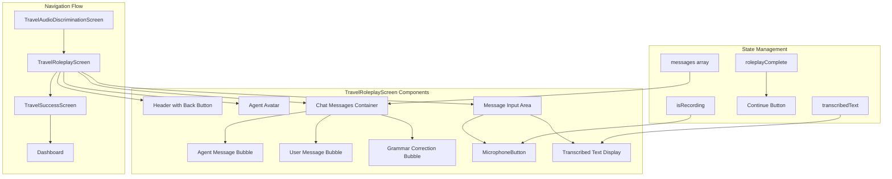

# Travel Roleplay Screen Implementation Plan

## Overview

Create an AI-powered conversation activity for the Travel lesson flow (Activity 10 of 12) that simulates an airport check-in roleplay. The screen will feature a chat interface with message bubbles, voice input via microphone, and navigation to a success screen upon completion.

## Architecture Diagram



## Files to Create/Modify

### 1. Create: `src/screens/TravelRoleplayScreen.jsx`

**Purpose:** Main roleplay screen with chat interface for airport check-in scenario

**Component Structure:**
- Header with back navigation and activity counter
- Agent avatar section with airport agent emoji
- Scrollable chat messages container
- Message bubbles for user and AI responses
- MicrophoneButton for voice input
- Transcribed text display
- Continue button when roleplay is complete

**Key Features:**
- Chat interface with distinct styling for agent vs user messages
- AI system prompt handling for grammar corrections
- Voice input integration via MicrophoneButton
- Completion detection based on conversation turns
- Navigation to TravelSuccessScreen

**Data Source:** Uses `travelLessonData.roleplay` for scenario configuration

### 2. Create: `src/screens/TravelSuccessScreen.jsx`

**Purpose:** Travel lesson completion screen following VIPSuccessScreen pattern

**Component Structure:**
- Celebratory icon/emoji
- Success headline
- Stats cards showing XP earned and lesson progress
- Sofia feedback card
- Back to Home button

### 3. Modify: `src/context/NavigationContext.jsx`

**Changes Required:**
- Add `TRAVEL_SUCCESS: 'travelSuccess'` to SCREENS constant
- Add `SCREENS.TRAVEL_SUCCESS` to FULL_SCREEN_SCREENS array
- Create `showTravelSuccess` navigation function
- Export `showTravelSuccess` in context value

### 4. Modify: `src/App.jsx`

**Changes Required:**
- Update lazy import for TravelRoleplayScreen to use dedicated screen
- Add lazy import for TravelSuccessScreen
- Add case for SCREENS.TRAVEL_SUCCESS in renderScreen switch

---

## Detailed Implementation Specifications

### TravelRoleplayScreen.jsx Component Specifications

#### State Variables
```javascript
const [messages, setMessages] = useState([]) // Chat message history
const [isRecording, setIsRecording] = useState(false) // Microphone state
const [transcribedText, setTranscribedText] = useState('') // Voice transcription
const [roleplayComplete, setRoleplayComplete] = useState(false) // Completion flag
const [turnCount, setTurnCount] = useState(0) // Track conversation turns
```

#### Message Object Structure
```javascript
{
  id: number,
  role: 'agent' | 'user',
  text: string,
  translation?: string, // Optional English translation
  correction?: string  // Grammar correction if applicable
}
```

#### AI System Prompt
The system prompt should be displayed or used for context:
```
You are an airport check-in agent. You are polite but efficient. 
You need to ask the user for their passport and where they are flying today. 
If they make a grammar mistake with Preterite vs Imperfect, gently correct 
them in parentheses but continue the roleplay.
```

#### Chat Message Bubble Styling

**Agent Messages:**
- Background: `#E0F2FE` light blue
- Border: `1px solid #BAE6FD`
- Border radius: `12px 12px 12px 4px`
- Agent name label above message
- Optional translation in smaller gray text

**User Messages:**
- Background: `#14B8A6` teal
- Color: white
- Border radius: `12px 12px 4px 12px`
- Right-aligned

**Grammar Correction:**
- Displayed in parentheses
- Color: `#F59E0B` amber
- Font style: italic
- Smaller font size

#### Completion Detection Logic
- Track conversation turns using turnCount
- Consider roleplay complete after 3-4 exchanges
- Alternatively, detect key phrases like passport/destination mentioned
- Show continue button when roleplayComplete is true

---

### TravelSuccessScreen.jsx Component Specifications

#### Visual Elements
- Icon: Airplane emoji ✈️ or passport emoji 🛂
- Headline: Travel Vocabulary Mastered!
- Subheadline: You can navigate airports in Spanish now.
- Stats: +20 XP earned, 12/12 Activities complete
- Sofia message about travel readiness

---

### NavigationContext.jsx Modifications

#### SCREENS constant addition
```javascript
TRAVEL_SUCCESS: 'travelSuccess',
```

#### FULL_SCREEN_SCREENS addition
```javascript
SCREENS.TRAVEL_SUCCESS,
```

#### New navigation function
```javascript
const showTravelSuccess = useCallback(() => {
  navigateTo(SCREENS.TRAVEL_SUCCESS);
}, [navigateTo]);
```

#### Context value export
Add `showTravelSuccess` to the contextValue useMemo and dependencies array.

---

### App.jsx Modifications

#### Update TravelRoleplayScreen import
```javascript
// Change from:
const TravelRoleplayScreen = lazy(() => import('./screens/VIPRoleplayScreen.jsx'))
// To:
const TravelRoleplayScreen = lazy(() => import('./screens/TravelRoleplayScreen.jsx'))
```

#### Add TravelSuccessScreen import
```javascript
const TravelSuccessScreen = lazy(() => import('./screens/TravelSuccessScreen.jsx'))
```

#### Add renderScreen case
```javascript
case SCREENS.TRAVEL_SUCCESS:
  return <TravelSuccessScreen />
```

---

## UI Mockup Description

### TravelRoleplayScreen Layout

```
┌─────────────────────────────────────┐
│  ← Airport Check-in    Activity 10/12│
├─────────────────────────────────────┤
│                                     │
│            ✈️ Agent                 │
│         Airport Check-in            │
│                                     │
├─────────────────────────────────────┤
│ ┌─────────────────────────────────┐ │
│ │ 👩‍✈️ Agent                        │ │
│ │ ¡Buenos días! Bienvenido a     │ │
│ │ Iberia Airlines. ¿En qué puedo │ │
│ │ ayudarle hoy?                   │ │
│ │ Good morning! Welcome to...     │ │
│ └─────────────────────────────────┘ │
│                                     │
│     ┌───────────────────────────┐   │
│     │ Hola, yo viajaba a Madrid.│   │
│     │ Aquí está mi pasaporte.   │   │
│     └───────────────────────────┘   │
│                                     │
│ ┌─────────────────────────────────┐ │
│ │ 👩‍✈️ Agent                        │ │
│ │ Perfecto, gracias por su      │ │
│ │ pasaporte.                     │ │
│ │ pequeña corrección: viajo...   │ │
│ └─────────────────────────────────┘ │
│                                     │
├─────────────────────────────────────┤
│                                     │
│           🎤 Hold to Speak          │
│                                     │
│     Recording... or Tap to speak    │
│                                     │
└─────────────────────────────────────┘
```

---

## Dependencies

### Existing Components to Reuse
- [`MicrophoneButton`](src/components/Lesson/MicrophoneButton.jsx) - Voice input
- [`SofiaAvatar`](src/components/shared/SofiaAvatar.jsx) - For success screen
- [`StatCard`](src/components/shared/StatCard.jsx) - For success screen stats
- [`useRecording`](src/hooks/useRecording.js) - Recording state hook
- [`useNavigation`](src/hooks/useNavigation.js) - Navigation hook

### Data Source
- [`travelLessonData.roleplay`](src/data/travelLessonData.js:261-312) - Scenario configuration

### Styling
- [`sharedStyles`](src/components/shared/sharedStyles.js) - iosButtonStyle, touchOptimized
- [`sharedAnimations`](src/components/shared/sharedAnimations.js) - pulseRing animation

---

## Implementation Order

1. **NavigationContext.jsx** - Add TRAVEL_SUCCESS screen and navigation
2. **App.jsx** - Update imports and add screen case
3. **TravelRoleplayScreen.jsx** - Build main chat interface
4. **TravelSuccessScreen.jsx** - Create completion screen
5. **Testing** - Verify full navigation flow

---

## Notes

- The current [`VIPRoleplayScreen`](src/screens/VIPRoleplayScreen.jsx) provides a simpler roleplay pattern without chat bubbles - the new TravelRoleplayScreen will be more sophisticated with a full chat interface
- Mock AI responses will be used for the wireframe - actual AI integration would come in a later phase
- The [`travelLessonData.roleplay`](src/data/travelLessonData.js:261-312) already contains the system prompt, starter message, and example conversation to guide implementation
- Grammar corrections should be visually distinct but not disruptive to the roleplay flow
