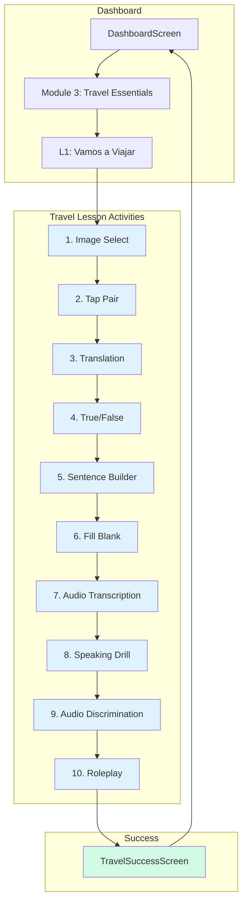

# Travel Lesson Success Screen & Flow Integration Plan

## Overview
Complete the lesson sequence with a success screen and flow integration for the Travel lesson (Module 3, Lesson 1: "Vamos a Viajar").

## Current State Analysis

### ✅ Already Implemented
1. **TravelSuccessScreen.jsx** - Exists at `src/screens/TravelSuccessScreen.jsx` with basic structure
2. **NavigationContext.jsx** - Has all travel navigation functions (showTravelImageSelect through showTravelSuccess)
3. **App.jsx** - Has all SCREENS constants and renderScreen cases for travel screens
4. **ModuleList.jsx** - Shows Module 3 as active with `onTravelLessonClick` handler
5. **DashboardScreen.jsx** - Connects to travel lesson via `showTravelImageSelect()`

### ⚠️ Issues to Address
1. **Activity Count Mismatch** - Data shows 12 activities but user wants 10 activities
2. **No Progress Bar** - Travel screens don't show lesson progress visually
3. **TravelSuccessScreen Enhancement** - Needs vocabulary list like VocabSuccessScreen
4. **Data Update Required** - travelLessonData.js needs updating for 10 activities

---

## Implementation Tasks

### Task 1: Update travelLessonData.js for 10 Activities

**File:** `src/data/travelLessonData.js`

**Changes:**
- Update `totalActivities` from 12 to 10 in all activity objects
- Remove `conversationCompletion` (Activity 11) and `culturalContext` (Activity 12) data
- Keep activities 1-10:
  1. imageSelect
  2. tapPair
  3. translation
  4. trueFalse
  5. sentenceBuilder
  6. fillBlank
  7. audioTranscription
  8. speakingDrill
  9. audioDiscrimination
  10. roleplay

---

### Task 2: Create/Update Progress Bar Component

**Option A: Inline Progress Bar in Each Screen**

Add a progress bar below the header in each travel screen:

```jsx
// Progress Bar Component Pattern
<Box sx={{ px: 2, pt: 1 }}>
  <Box
    sx={{
      height: 6,
      backgroundColor: '#E5E7EB',
      borderRadius: 3,
      overflow: 'hidden',
    }}
  >
    <Box
      sx={{
        height: '100%',
        width: `${(activityNumber / totalActivities) * 100}%`,
        backgroundColor: '#14B8A6',
        borderRadius: 3,
        transition: 'width 0.3s ease',
      }}
    />
  </Box>
</Box>
```

**Files to Update:**
- `TravelImageSelectScreen.jsx` (Activity 1)
- `TravelTapPairScreen.jsx` (Activity 2)
- `TravelTranslationScreen.jsx` (Activity 3)
- `TravelTrueFalseScreen.jsx` (Activity 4)
- `TravelSentenceBuilderScreen.jsx` (Activity 5)
- `TravelFillBlankScreen.jsx` (Activity 6)
- `TravelAudioTranscriptionScreen.jsx` (Activity 7)
- `TravelSpeakingDrillScreen.jsx` (Activity 8)
- `TravelAudioDiscriminationScreen.jsx` (Activity 9)
- `TravelRoleplayScreen.jsx` (Activity 10)

---

### Task 3: Enhance TravelSuccessScreen.jsx

**Pattern to Follow:** `src/screens/VocabSuccessScreen.jsx`

**Enhancements Needed:**

1. **Add Vocabulary Summary Card** - Show travel words learned
2. **Use StatCard Component** - For XP, accuracy, and word count
3. **Add Sofia Feedback Card** - Celebratory message from Sofia
4. **Update Stats to Match VocabSuccessScreen Pattern**

**Suggested Vocabulary to Display:**
```javascript
const learnedWords = [
  { spanish: 'La Maleta', english: 'The Suitcase', emoji: '🧳' },
  { spanish: 'El Vuelo', english: 'The Flight', emoji: '✈️' },
  { spanish: 'El Pasaporte', english: 'The Passport', emoji: '🛂' },
  { spanish: 'La Reserva', english: 'The Reservation', emoji: '📋' },
  { spanish: 'La Aduana', english: 'Customs', emoji: '🚪' },
];
```

**Updated Component Structure:**
```
Box (container)
├── Success Icon (✈️ or ✓)
├── Headline: "Travel Vocabulary Mastered!"
├── Subheadline: "You learned X new travel words"
├── Stats Row
│   ├── StatCard (Accuracy: 100%)
│   ├── StatCard (XP Earned: +20)
│   └── StatCard (Words: 5)
├── Vocabulary Summary Card (list of learned words)
├── Sofia Feedback Card
└── Action Buttons
    ├── "Return to Dashboard" (primary)
    └── "Practice Again" (secondary/optional)
```

---

### Task 4: Verify App.jsx Routes

**File:** `src/App.jsx`

**Current State:** ✅ All routes appear to be correctly configured (lines 342-363)

**Verification Checklist:**
- [x] TRAVEL_IMAGE_SELECT → TravelImageSelectScreen
- [x] TRAVEL_TAP_PAIR → TravelTapPairScreen
- [x] TRAVEL_TRANSLATION → TravelTranslationScreen
- [x] TRAVEL_TRUE_FALSE → TravelTrueFalseScreen
- [x] TRAVEL_SENTENCE_BUILDER → TravelSentenceBuilderScreen
- [x] TRAVEL_FILL_BLANK → TravelFillBlankScreen
- [x] TRAVEL_AUDIO_TRANSCRIPTION → TravelAudioTranscriptionScreen
- [x] TRAVEL_SPEAKING_DRILL → TravelSpeakingDrillScreen
- [x] TRAVEL_AUDIO_DISCRIMINATION → TravelAudioDiscriminationScreen
- [x] TRAVEL_ROLEPLAY → TravelRoleplayScreen
- [x] TRAVEL_SUCCESS → TravelSuccessScreen

---

### Task 5: Verify ModuleList.jsx Configuration

**File:** `src/components/Dashboard/ModuleList.jsx`

**Current State:** ✅ Module 3 is configured correctly

**Verification:**
- Module 3 shows as active when `showLockedModule={false}` (line 515)
- Lesson 1 "Vamos a Viajar" has `onClick: onTravelLessonClick` (line 309)
- DashboardScreen passes `onTravelLessonClick={handleTravelLesson}` (line 143)

---

## Navigation Flow Diagram



---

## File Modification Summary

| File | Action | Priority |
|------|--------|----------|
| `src/data/travelLessonData.js` | Update totalActivities to 10, remove activities 11-12 | High |
| `src/screens/TravelSuccessScreen.jsx` | Enhance with vocab list, stats, Sofia feedback | High |
| `src/screens/TravelImageSelectScreen.jsx` | Add progress bar | Medium |
| `src/screens/TravelTapPairScreen.jsx` | Add progress bar | Medium |
| `src/screens/TravelTranslationScreen.jsx` | Add progress bar | Medium |
| `src/screens/TravelTrueFalseScreen.jsx` | Add progress bar | Medium |
| `src/screens/TravelSentenceBuilderScreen.jsx` | Add progress bar | Medium |
| `src/screens/TravelFillBlankScreen.jsx` | Add progress bar | Medium |
| `src/screens/TravelAudioTranscriptionScreen.jsx` | Add progress bar | Medium |
| `src/screens/TravelSpeakingDrillScreen.jsx` | Add progress bar | Medium |
| `src/screens/TravelAudioDiscriminationScreen.jsx` | Add progress bar | Medium |
| `src/screens/TravelRoleplayScreen.jsx` | Add progress bar | Medium |
| `src/App.jsx` | Verify routes (no changes expected) | Low |
| `src/components/Dashboard/ModuleList.jsx` | Verify config (no changes expected) | Low |

---

## Testing Checklist

After implementation, verify:

1. [ ] **Dashboard Navigation**
   - Click Module 3 → L1: Vamos a Viajar
   - Should navigate to TravelImageSelectScreen

2. [ ] **Progress Bar Display**
   - Each screen shows progress bar at top
   - Progress increases as user advances (10%, 20%, ..., 100%)

3. [ ] **Activity Flow (10 Activities)**
   - Activity 1 → 2 → 3 → 4 → 5 → 6 → 7 → 8 → 9 → 10
   - Each "Continue" button advances to next activity

4. [ ] **Success Screen**
   - Shows after completing Activity 10 (Roleplay)
   - Displays XP earned (+20 XP)
   - Shows vocabulary learned count
   - Lists travel words with translations
   - Sofia celebration message appears
   - "Return to Dashboard" button works

5. [ ] **Return to Dashboard**
   - Successfully returns to DashboardScreen
   - No navigation errors or blank screens

---

## Dependencies

- MUI Components: Box, Typography, Card, Button, Grid
- Shared Components: StatCard, SofiaAvatar, FeedbackCard
- Navigation: useNavigation hook
- Styles: iosButtonStyle from sharedStyles.js

---

## Notes

- The existing TravelSuccessScreen has a good foundation but needs enhancement
- Progress bar pattern can be extracted to a shared component if desired
- Consider creating a TravelProgressBar.jsx component for reusability
