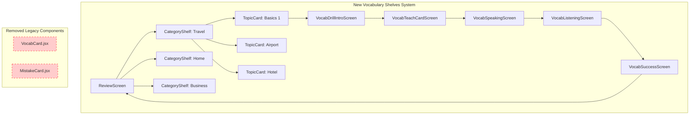
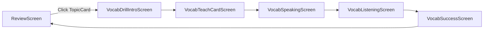

# Vocabulary Shelves Migration Guide

**Migration Date:** January 2026  
**Migration Type:** Component Refactoring  
**Status:** Complete

---

## Overview

This document describes the migration from the legacy Review system to the new "Vocabulary Shelves" system. The refactoring transformed the vocabulary learning experience from a table-based display to a Netflix-style swimlane interface with categorized topics.

---

## What Changed

### UI/UX Transformation

#### Before (Legacy System)
- **VocabCard.jsx**: Displayed individual vocabulary items in a table format
- **MistakeCard.jsx**: Displayed user mistakes separately in another table
- Flat list of vocabulary items without categorization
- Separate sections for vocabulary and mistakes
- Linear, list-based navigation

#### After (Vocabulary Shelves System)
- **CategoryShelf.jsx**: Horizontal swimlane containers for each category
- **TopicCard.jsx**: 120x120px clickable cards for individual topics
- Categorized vocabulary organized by themes (Travel, Home, Business, etc.)
- Integrated progress tracking within topic cards
- Netflix-style horizontal scrolling with fade edges

### Visual Comparison

```
┌─────────────────────────────────────────────────────────┐
│ LEGACY: Table-Based Layout                              │
├─────────────────────────────────────────────────────────┤
│ Vocabulary                                              │
│ ┌─────────────┬─────────────┬─────────────┐            │
│ │ Spanish     │ English     │ Status      │            │
│ ├─────────────┼─────────────┼─────────────┤            │
│ │ Hola        │ Hello       │ ✓ Learned   │            │
│ │ Adiós       │ Goodbye     │ ✓ Learned   │            │
│ │ Gracias     │ Thank you   │ In Progress │            │
│ └─────────────┴─────────────┴─────────────┘            │
│                                                         │
│ Mistakes                                                │
│ ┌─────────────┬─────────────┬─────────────┐            │
│ │ Word        │ Your Answer │ Correct     │            │
│ ├─────────────┼─────────────┼─────────────┤            │
│ │ Ser         │ Estar       │ Ser         │            │
│ └─────────────┴─────────────┴─────────────┘            │
└─────────────────────────────────────────────────────────┘

┌─────────────────────────────────────────────────────────┐
│ NEW: Vocabulary Shelves (Netflix-Style)                │
├─────────────────────────────────────────────────────────┤
│ Travel ─────────────────────────────────────── [A1]     │
│ Essential words for your next trip                      │
│ 42 words to learn                                       │
│                                                         │
│ ┌──────┐ ┌──────┐ ┌──────┐ ┌──────┐ ┌──────┐          │
│ │ ✈️   │ │ 🏨   │ │ 🍽️   │ │ 🚕   │ │ 🛍️   │          │
│ │Basics│ │Hotel │ │Food  │ │Taxi  │ │Shop  │          │
│ │ 12/15│ │ 8/10 │ │ 5/8  │ │ 0/5  │ │ 0/7  │          │
│ └──────┘ └──────┘ └──────┘ └──────┘ └──────┘          │
│                                                         │
│ Home ──────────────────────────────────────── [A2]     │
│ Everyday vocabulary for daily life                        │
│ 35 words to learn                                       │
│                                                         │
│ ┌──────┐ ┌──────┐ ┌──────┐ ┌──────┐                    │
│ │ 🏠   │ │ 🛋️   │ │ 🍳   │ │ 🛏️   │                    │
│ │Rooms │ │Living│ │Kitchen│ │Bedroom│                   │
│ │ 10/12│ │ 6/8  │ │ 4/6  │ │ 0/5  │                    │
│ └──────┘ └──────┘ └──────┘ └──────┘                    │
└─────────────────────────────────────────────────────────┘
```

---

## Component Changes

### Removed Components

| Component | File | Reason for Removal |
|-----------|------|-------------------|
| `VocabCard` | `VocabCard.jsx` | Replaced by `TopicCard` with better UX |
| `MistakeCard` | `MistakeCard.jsx` | Integrated into topic-based progress tracking |

### New Components

| Component | File | Purpose |
|-----------|------|---------|
| `CategoryShelf` | `CategoryShelf.jsx` | Horizontal swimlane displaying category metadata and topic list |
| `TopicCard` | `TopicCard.jsx` | 120x120px clickable card for vocabulary topics |

---

## Data Structure Changes

### Before (Flat Vocabulary List)

```javascript
const vocabularyData = [
  { id: 1, spanish: 'Hola', english: 'Hello', status: 'learned' },
  { id: 2, spanish: 'Adiós', english: 'Goodbye', status: 'learned' },
  { id: 3, spanish: 'Gracias', english: 'Thank you', status: 'in-progress' },
  // ... more items
]
```

### After (Categorized Topics)

```javascript
const vocabularyShelves = [
  {
    id: 'travel',
    title: 'Travel',
    levelLabel: 'A1',
    description: 'Essential words for your next trip',
    items: [
      {
        id: 'travel-basics',
        title: 'Basics 1',
        icon: '✈️',
        level: 'A1',
        words: [
          { spanish: 'Hola', english: 'Hello', status: 'learned' },
          { spanish: 'Adiós', english: 'Goodbye', status: 'learned' },
          // ... more words
        ]
      },
      {
        id: 'travel-hotel',
        title: 'Hotel',
        icon: '🏨',
        level: 'A1',
        words: [
          // ... hotel-specific words
        ]
      }
      // ... more topics
    ]
  },
  // ... more categories
]
```

See [`src/data/vocabularyShelves.js`](../../data/vocabularyShelves.js) for the complete data structure.

---

## Architecture Diagram



---

## For Developers

### Working with CategoryShelf

The [`CategoryShelf`](CategoryShelf.jsx) component accepts the following props:

| Prop | Type | Required | Description |
|------|------|----------|-------------|
| `title` | string | Yes | Category display name |
| `levelLabel` | string | Yes | CEFR level (A1, A2, B1, B2) |
| `description` | string | No | Category description |
| `items` | array | Yes | Array of topic objects |
| `onTopicClick` | function | Yes | Callback when a topic is clicked |

Example usage:

```javascript
<CategoryShelf
  title="Travel"
  levelLabel="A1"
  description="Essential words for your next trip"
  items={travelTopics}
  onTopicClick={(topic) => navigateToVocabDrill(topic)}
/>
```

### Working with TopicCard

The [`TopicCard`](TopicCard.jsx) component accepts the following props:

| Prop | Type | Required | Description |
|------|------|----------|-------------|
| `title` | string | Yes | Topic display name |
| `icon` | string | Yes | Emoji or icon for the topic |
| `level` | string | No | CEFR level for the topic |
| `totalWords` | number | No | Total number of words in topic |
| `progress` | number | No | Number of words completed |
| `onClick` | function | Yes | Callback when card is clicked |

Example usage:

```javascript
<TopicCard
  title="Basics 1"
  icon="✈️"
  level="A1"
  totalWords={15}
  progress={12}
  onClick={() => handleTopicClick(topic)}
/>
```

### Adding a New Category

1. Add the category to [`src/data/vocabularyShelves.js`](../../data/vocabularyShelves.js):

```javascript
{
  id: 'your-category',
  title: 'Your Category',
  levelLabel: 'A1',
  description: 'Description of your category',
  items: [
    {
      id: 'your-topic',
      title: 'Your Topic',
      icon: '🎯',
      level: 'A1',
      words: [
        { spanish: 'palabra', english: 'word', status: 'new' }
      ]
    }
  ]
}
```

2. The category will automatically appear in [`ReviewScreen.jsx`](../../screens/ReviewScreen.jsx)

### Navigation Flow

The vocabulary drill flow now starts from the Review screen:



---

## Migration Checklist

- [x] Document migration in [`CategoryShelf.jsx`](CategoryShelf.jsx)
- [x] Document migration in [`TopicCard.jsx`](TopicCard.jsx)
- [x] Update [`README.md`](../../../README.md) Project Structure section
- [x] Update [`README.md`](../../../README.md) Component Library section
- [x] Update [`README.md`](../../../README.md) Screen Flows section
- [x] Create this MIGRATION.md documentation
- [x] Remove `VocabCard.jsx`
- [x] Remove `MistakeCard.jsx`
- [x] Verify no broken imports remain

---

## Benefits of the New System

1. **Better UX**: Netflix-style horizontal scrolling is more engaging than tables
2. **Clearer Organization**: Categories help users find relevant vocabulary
3. **Visual Progress**: Topic cards show progress at a glance
4. **Scalability**: Easy to add new categories and topics
5. **Mobile-First**: Optimized for touch interactions on mobile devices
6. **Accessibility**: Keyboard navigation and ARIA labels included

---

## References

- [`CategoryShelf.jsx`](CategoryShelf.jsx) - Main swimlane component
- [`TopicCard.jsx`](TopicCard.jsx) - Individual topic card component
- [`ReviewScreen.jsx`](../../screens/ReviewScreen.jsx) - Screen using these components
- [`vocabularyShelves.js`](../../data/vocabularyShelves.js) - Data structure
- [`README.md`](../../../README.md) - Project documentation

---

*Last updated: January 2026*